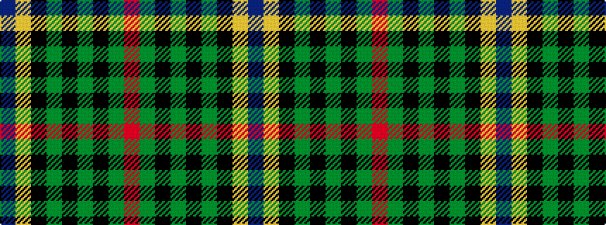

BYKGKGKGR

It is a 9 stripe tartan.

<figure class="pat-woven">

<figcaption>idealised sample</figcaption>
</figure>

## Colour Sequence



## Tartans with this colour sequence

| Tartans |
|---------------|
| [Ogilvie 1](/variants/s9/db24ly2k8g16k1g3k1g3r4~x2/)|
||
| [Ogilvy Hunting](/variants/s9/db24ly2k8dg16k1dg3k1dg3r4~x2/)|
||
