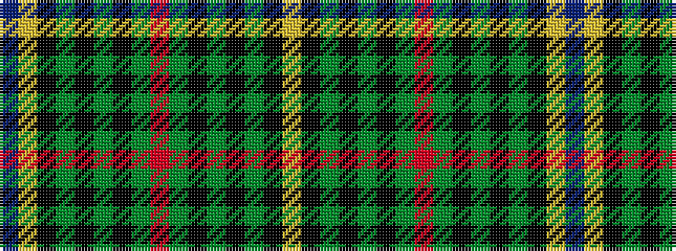

BYKGKGKGRGKGKGKY

It is a 16 stripe tartan.

<figure class="pat-woven">

<figcaption>idealised sample</figcaption>
</figure>

## Colour Sequence



## Tartans with this colour sequence

| Tartans |
|---------------|
| [Ogilvie of Inverarity (Wilson) / Ochterlonie](/variants/s16/db20ly3k7g11k2g3k2g3r4~x2/)|
||
