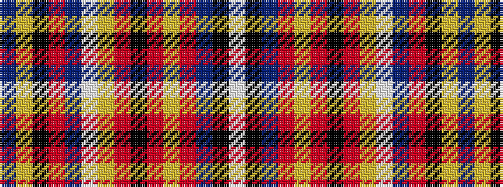

BYKRBWYRKRYRBKW

It is a 15 stripe tartan.

<figure class="pat-woven">

<figcaption>idealised sample</figcaption>
</figure>

## Colour Sequence



## Tartans with this colour sequence

| Tartans |
|---------------|
| [Clare County Crest (Fashion)](/setts/s15/db62lo3k3r15db18w3lo28o12k3o5lo5o5db6k12w8/)|
||
