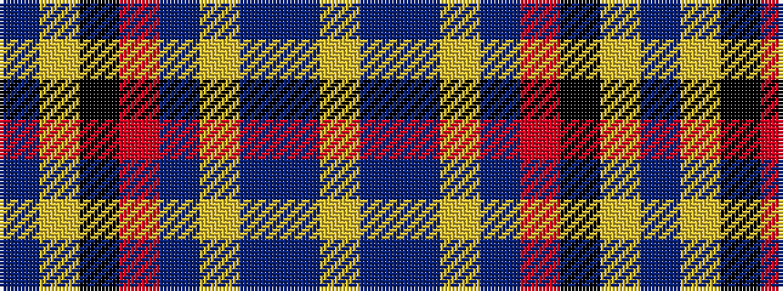

BYKRBYBBY

It is a 9 stripe tartan.

<figure class="pat-woven">

<figcaption>idealised sample</figcaption>
</figure>

## Colour Sequence



## Tartans with this colour sequence

| Tartans |
|---------------|
| [US Air Force Reserve Pipe Band](/setts/s9/db44lo3k20r3db8lg34db3db2lg15~x2/)|
||
