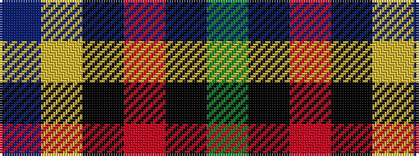

BYKRKG

It is a 6 stripe tartan.

<figure class="pat-woven">

<figcaption>idealised sample</figcaption>
</figure>

## Colour Sequence



## Tartans with this colour sequence

| Tartans |
|---------------|
| [Moran Family Tartan](/variants/s6/g55k17r9k11ly2db4~x2/)|
||
