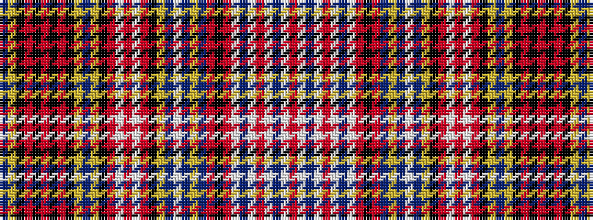

BYKRKRKRKYBYKRWRWRKYBWBYBRKRWBWRWBWR

It is a 36 stripe tartan.

<figure class="pat-woven">

<figcaption>idealised sample</figcaption>
</figure>

## Colour Sequence



## Tartans with this colour sequence

| Tartans |
|---------------|
| [Ogilvie (Paton) #2](/setts/s36/t6ly1k1r1k1r1k1r1k1ly4t3ly4k3r3w1r3w1r3k3ly1t3w1t3ly1db1r1k1r4w1db1w1r4w1db1w1r4~x4/)|
||
