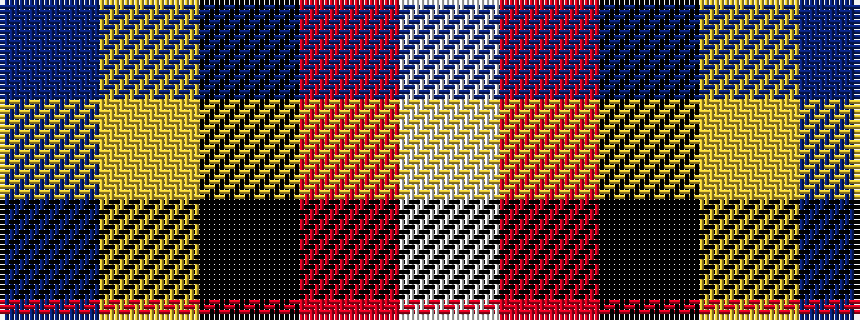

BYKRW

It is a 5 stripe tartan.

<figure class="pat-woven">

<figcaption>idealised sample</figcaption>
</figure>

## Colour Sequence



## Tartans with this colour sequence

| Tartans |
|---------------|
| [Ballater Victoria Week](/variants/s5/dp8ly6k2o1w1~x8/)|
||
