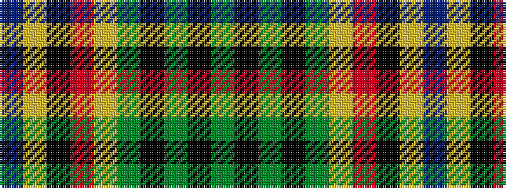

BYKRYGKGKG

It is a 10 stripe tartan.

<figure class="pat-woven">

<figcaption>idealised sample</figcaption>
</figure>

## Colour Sequence



## Tartans with this colour sequence

| Tartans |
|---------------|
| [Moran (French) (Name)](/setts/s10/dg67k2dg2k2dg2ly8r8k8ly2t7~x2/)|
||
| [Moran Family Ubique](/setts/s10/dg68k2dg2k2dg2lo8r8k8lo2db7~x2/)|
||
