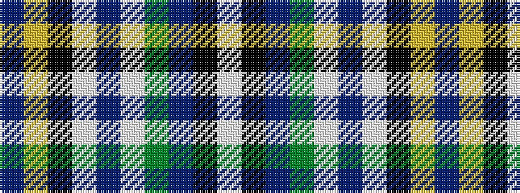

BYKWBWGBKW

It is a 10 stripe tartan.

<figure class="pat-woven">

<figcaption>idealised sample</figcaption>
</figure>

## Colour Sequence



## Tartans with this colour sequence

| Tartans |
|---------------|
| [MacBeth Dress (Dance)](/variants/s10/w50k1dp14g14w2dp2w2k4ly2db30~x2/)|
||
