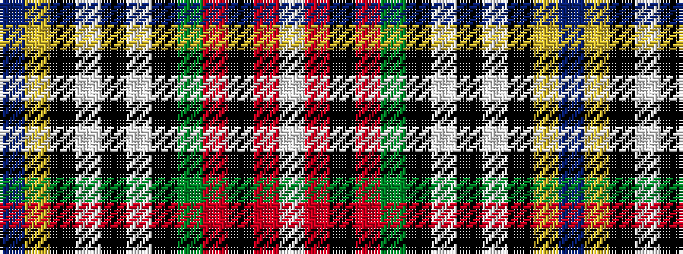

BYKWKWKGRKRW

It is a 12 stripe tartan.

<figure class="pat-woven">

<figcaption>idealised sample</figcaption>
</figure>

## Colour Sequence



## Tartans with this colour sequence

| Tartans |
|---------------|
| [MacBeth](/setts/s12/db36ly4k6lb1k1lb1k1dg8r6k1r3lb1/)|
||
| [MacBeth](/setts/s12/db40ly4k3w2k3w2k3g10r6k2r4w2~x2/)|
||
| [MacBeth](/setts/s12/db36ly4k5w1k1w1k2g8r6k1r3w1~x4/)|
||
| [MacBeth #2](/setts/s12/db40ly4k3w2k3w2k3dg10r6k2r4w2~x2/)|
||
