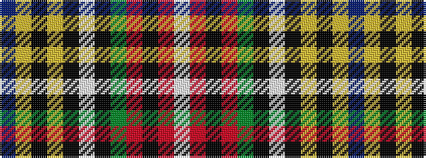

BYKYKWKGRKRW

It is a 12 stripe tartan.

<figure class="pat-woven">

<figcaption>idealised sample</figcaption>
</figure>

## Colour Sequence



## Tartans with this colour sequence

| Tartans |
|---------------|
| [MacBeth, MacLulich](/setts/s12/db36ly4k6ly1k1w1k1g8r6k1r3w1~x2/)|
||
