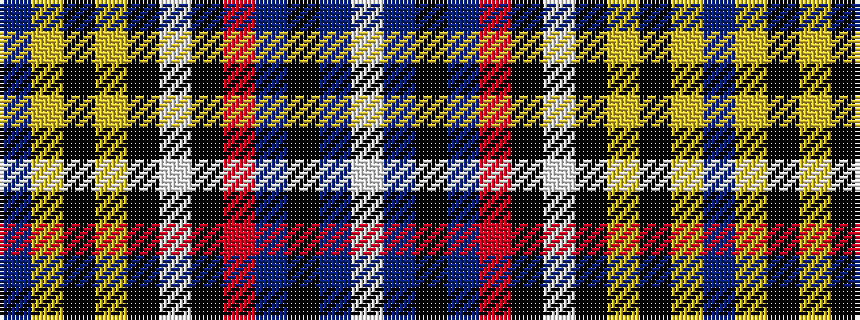

BYKYKWKRBKBW

It is a 12 stripe tartan.

<figure class="pat-woven">

<figcaption>idealised sample</figcaption>
</figure>

## Colour Sequence



## Tartans with this colour sequence

| Tartans |
|---------------|
| [Stevens #4](/setts/s12/p27ly2k3lo2k2w2k2o6p3k2p2w2~x2/)|
||
