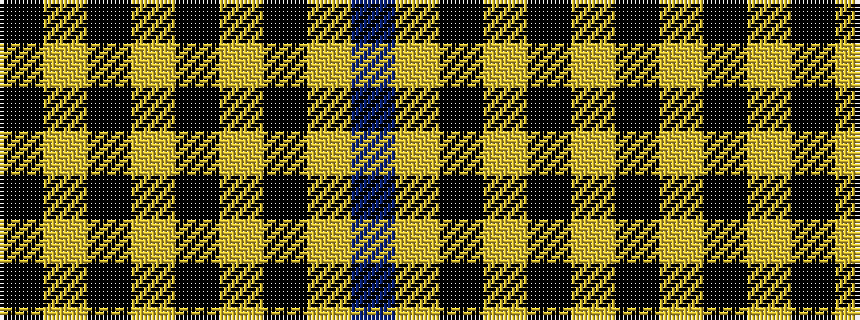

BYKYKYKYK

It is a 9 stripe tartan.

<figure class="pat-woven">

<figcaption>idealised sample</figcaption>
</figure>

## Colour Sequence



## Tartans with this colour sequence

| Tartans |
|---------------|
| [Cardiff City Football Club (Corp)](/setts/s9/k4lo24ki13lo2ki4lo3ki1lo3t2~x2/)|
||
