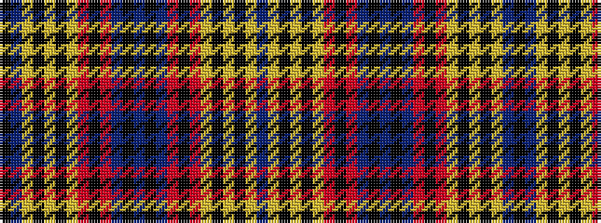

BYKYKYRKRBKBKBRKRYKYKYBK

It is a 24 stripe tartan.

<figure class="pat-woven">

<figcaption>idealised sample</figcaption>
</figure>

## Colour Sequence



## Tartans with this colour sequence

| Tartans |
|---------------|
| [Franklin](/variants/s24/b3ly5k1ly2k1ly5r3k2r3b6k1b1k1b6r3k2r3ly5k1ly2k1ly5b3k2~x4/)|
||
