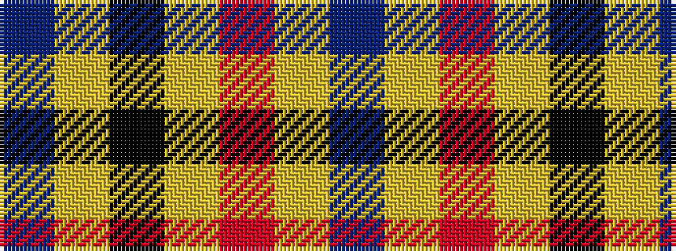

BYKYRYB

It is a 7 stripe tartan.

<figure class="pat-woven">

<figcaption>idealised sample</figcaption>
</figure>

## Colour Sequence



## Tartans with this colour sequence

| Tartans |
|---------------|
| [Carlisle](/setts/s7/t11ly5k1ly2r1ly2t11~x12/)|
||
| [Carlisle Family (Name)](/setts/s7/b33lo6r3lo6k3lo15b32~x4/)|
||
