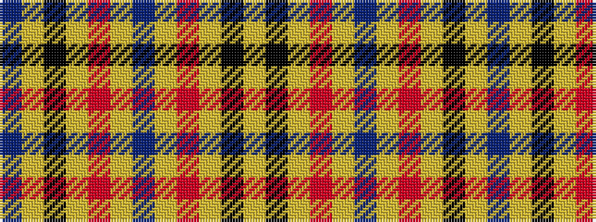

BYKYRYBYRYKY

It is a 12 stripe tartan.

<figure class="pat-woven">

<figcaption>idealised sample</figcaption>
</figure>

## Colour Sequence



## Tartans with this colour sequence

| Tartans |
|---------------|
| [Carlisle (Family)](/variants/s12/b33lo6r3lo6k3lo15b32~x4/)|
||
