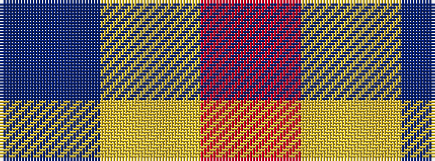

BYR

It is a 3 stripe tartan.

<figure class="pat-woven">

<figcaption>idealised sample</figcaption>
</figure>

## Colour Sequence



## Tartans with this colour sequence

| Tartans |
|---------------|
| [Nutwood](/variants/s3/r1ly60b1~x2/)|
||
| [Usa](/variants/s3/db1lr1r1~x4/)|
||
