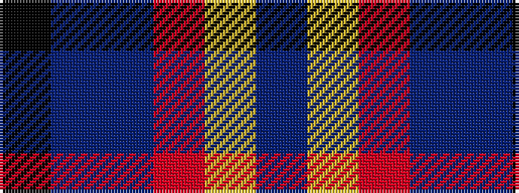

BYRBBK

It is a 6 stripe tartan.

<figure class="pat-woven">

<figcaption>idealised sample</figcaption>
</figure>

## Colour Sequence



## Tartans with this colour sequence

| Tartans |
|---------------|
| [Meeson Hunting](/setts/s6/k26n10dt19r6ly2db9~x2/)|
||
