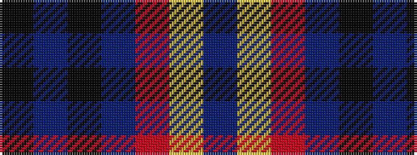

BYRBKBK

It is a 7 stripe tartan.

<figure class="pat-woven">

<figcaption>idealised sample</figcaption>
</figure>

## Colour Sequence



## Tartans with this colour sequence

| Tartans |
|---------------|
| [McKnight #2 (Personal)](/setts/s7/t4ly1r28db24k5t5k3~x4/)|
||
| [McKnight (Personal)](/setts/s7/db4ly1r28db25k10db5k3~x2/)|
||
