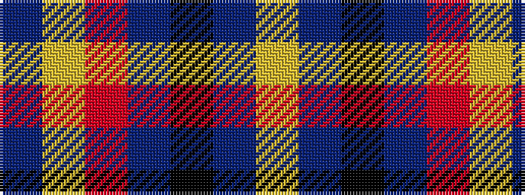

BYRBKBY

It is a 7 stripe tartan.

<figure class="pat-woven">

<figcaption>idealised sample</figcaption>
</figure>

## Colour Sequence



## Tartans with this colour sequence

| Tartans |
|---------------|
| [Isle of Gigha (District)](/variants/s7/lo2db4k1db4m4lo4db1~x8/)|
||
