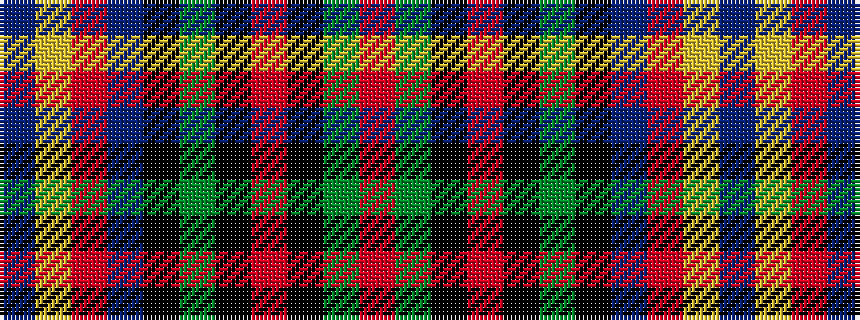

BYRBKGKRKGR

It is a 11 stripe tartan.

<figure class="pat-woven">

<figcaption>idealised sample</figcaption>
</figure>

## Colour Sequence



## Tartans with this colour sequence

| Tartans |
|---------------|
| [Blais](/variants/s11/db20ly1o1db3k1y2k1r10k1y2r4~x2/)|
||
