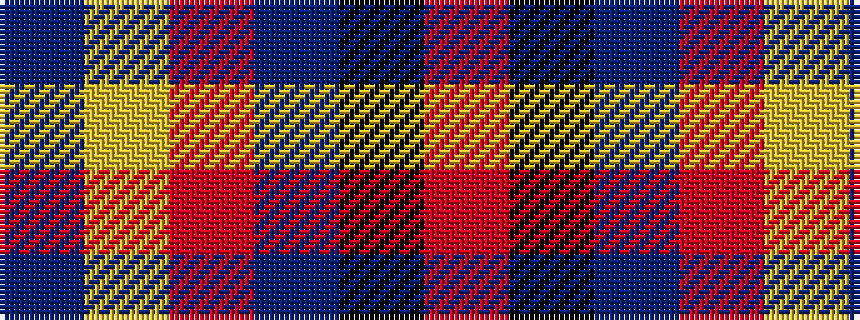

BYRBKR

It is a 6 stripe tartan.

<figure class="pat-woven">

<figcaption>idealised sample</figcaption>
</figure>

## Colour Sequence



## Tartans with this colour sequence

| Tartans |
|---------------|
| [Christie (London) Hunting](/setts/s6/dt60lr11oi5n5k1o4~x2/)|
||
