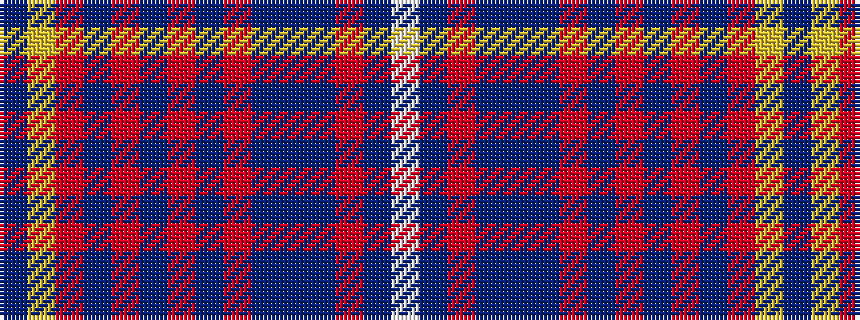

BYRBRBRBRBBBRBW

It is a 15 stripe tartan.

<figure class="pat-woven">

<figcaption>idealised sample</figcaption>
</figure>

## Colour Sequence



## Tartans with this colour sequence

| Tartans |
|---------------|
| [Matchpoint Dress](/setts/s15/db6ly2o24db4o8db6o6db6o3db10n14db4r3db34lb4/)|
||
