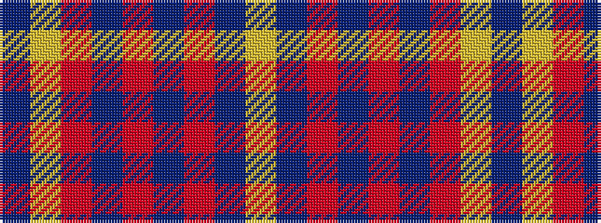

BYRBRBRBY

It is a 9 stripe tartan.

<figure class="pat-woven">

<figcaption>idealised sample</figcaption>
</figure>

## Colour Sequence



## Tartans with this colour sequence

| Tartans |
|---------------|
| [Orlando Fire Department (Corporate)](/variants/s9/db12ly1r16db1r1db14r3db14ly1~x4/)|
||
