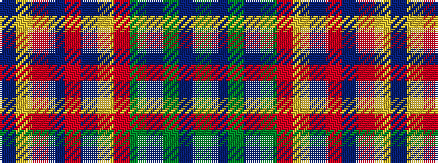

BYRBRBYRGBGBG

It is a 13 stripe tartan.

<figure class="pat-woven">

<figcaption>idealised sample</figcaption>
</figure>

## Colour Sequence



## Tartans with this colour sequence

| Tartans |
|---------------|
| [Pitcairn Heritage (Name)](/setts/s13/g3b4g3b4g3ri28lo2b2r28b6r9lo2b2~x2/)|
||
| [Pitcairn Trust Company](/setts/s13/g3db3g3db3g3m22ly2db2r22t5r8ly2t2~x2/)|
||
