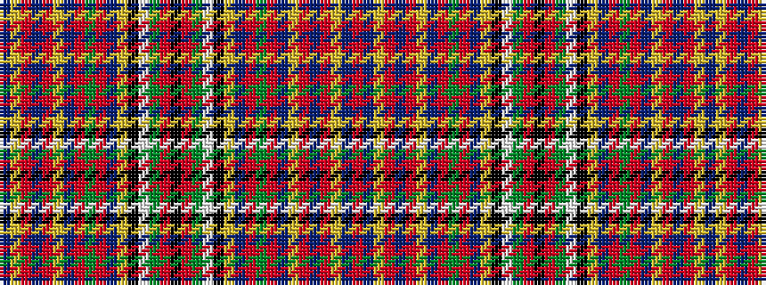

BYRBRYBRGRBYKWGRKRGWKYBRGRBYRBRYBR

It is a 34 stripe tartan.

<figure class="pat-woven">

<figcaption>idealised sample</figcaption>
</figure>

## Colour Sequence



## Tartans with this colour sequence

| Tartans |
|---------------|
| [MacFarhadian Canadian Personal Tartan](/variants/s34/r55dp1ly1r3dp7r3ly1dp1r3g16r3dp1ly1k3w1g5r3k2~x2/)|
||
