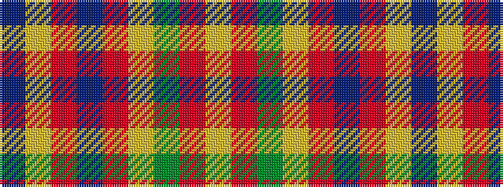

BYRBRYGRY

It is a 9 stripe tartan.

<figure class="pat-woven">

<figcaption>idealised sample</figcaption>
</figure>

## Colour Sequence



## Tartans with this colour sequence

| Tartans |
|---------------|
| [Land's End Maroon](/setts/s9/dt23lo2r3db7r3lo2g15r21lo5~x2/)|
||
