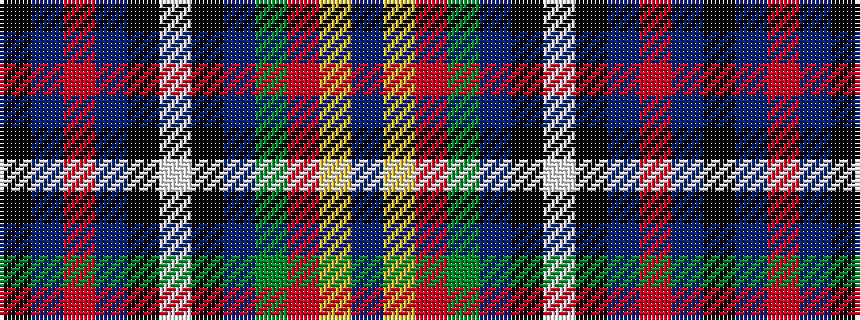

BYRGBKWKBRBK

It is a 12 stripe tartan.

<figure class="pat-woven">

<figcaption>idealised sample</figcaption>
</figure>

## Colour Sequence



## Tartans with this colour sequence

| Tartans |
|---------------|
| [Cascade Summers](/setts/s12/k3b13o11b3k10lb2k10b3g6o3lg13b3~x2/)|
||
