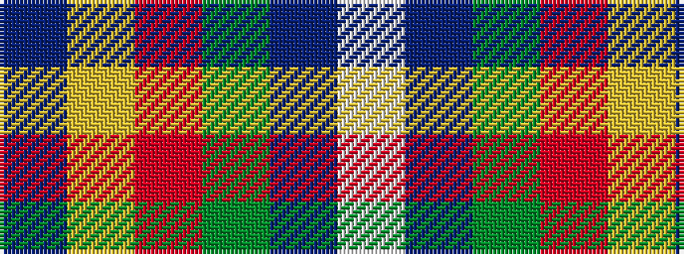

BYRGBW

It is a 6 stripe tartan.

<figure class="pat-woven">

<figcaption>idealised sample</figcaption>
</figure>

## Colour Sequence



## Tartans with this colour sequence

| Tartans |
|---------------|
| [Meh Dundee](/setts/s6/db13ly2r4g2t8w2~x6/)|
||
