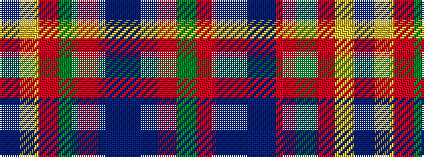

BYRGRBBBRG

It is a 10 stripe tartan.

<figure class="pat-woven">

<figcaption>idealised sample</figcaption>
</figure>

## Colour Sequence



## Tartans with this colour sequence

| Tartans |
|---------------|
| [Glasgow Cathedral 2000](/setts/s10/dg22r3dt10b2dt10r21dg22r3ly2dt2~x2/)|
||
