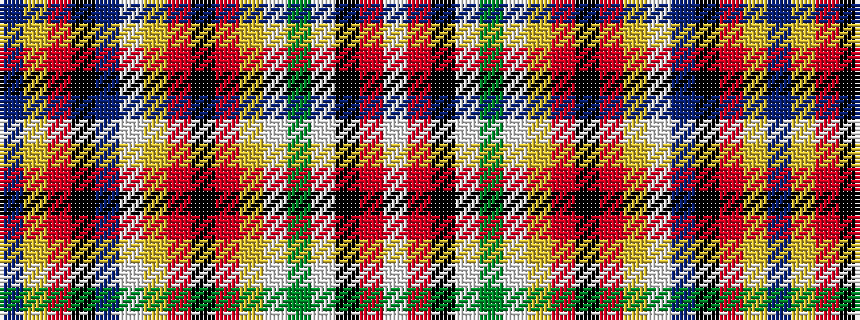

BYRKBWYRKRYWGWKRW

It is a 17 stripe tartan.

<figure class="pat-woven">

<figcaption>idealised sample</figcaption>
</figure>

## Colour Sequence



## Tartans with this colour sequence

| Tartans |
|---------------|
| [MacPherson #3](/variants/s17/db3ly5r4k4db14w3ly4r4k2r4ly4w3dg17w3k3r22w3~x2/)|
||
| [MacPherson 4](/variants/s17/db3ly5r4k4db14w3ly4r4k2r4ly4w3g17w3k3r22w3~x2/)|
||
