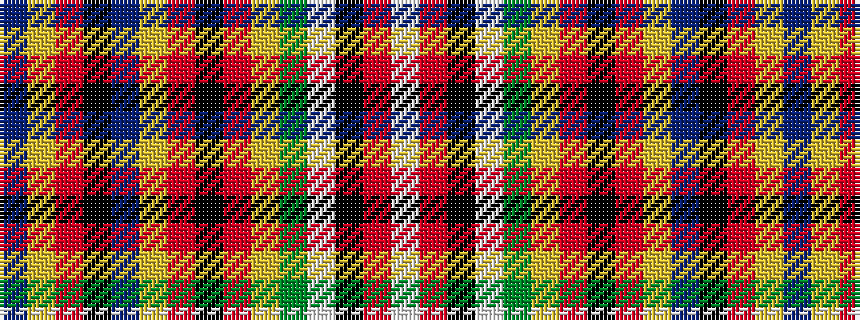

BYRKBYRKRYGWKRW

It is a 15 stripe tartan.

<figure class="pat-woven">

<figcaption>idealised sample</figcaption>
</figure>

## Colour Sequence



## Tartans with this colour sequence

| Tartans |
|---------------|
| [MacPherson #2](/setts/s15/db1ly3r3k2db8ly3r2k1r2ly3dg8w1k1r12w1~x2/)|
||
| [MacPherson 5](/setts/s15/db1ly3r3k2db8ly3r2k1r2ly3g8w1k1r12w1~x2/)|
||
