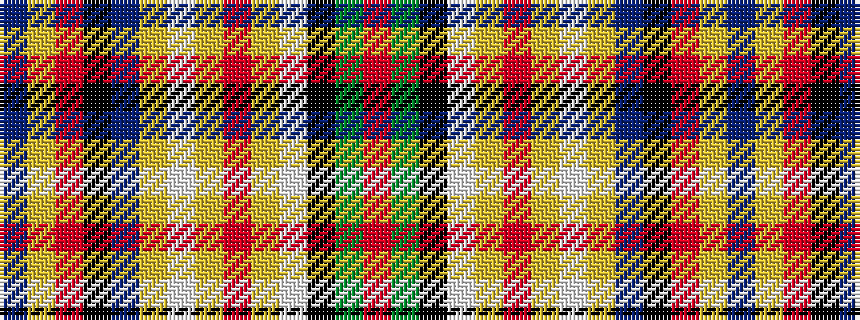

BYRKBYWYRYWKGR

It is a 14 stripe tartan.

<figure class="pat-woven">

<figcaption>idealised sample</figcaption>
</figure>

## Colour Sequence



## Tartans with this colour sequence

| Tartans |
|---------------|
| [Roman (Personal)](/variants/s14/r27g20k7w3lo3r2lo3w3lo6dp6k2r3lo4dp3~x2/)|
||
