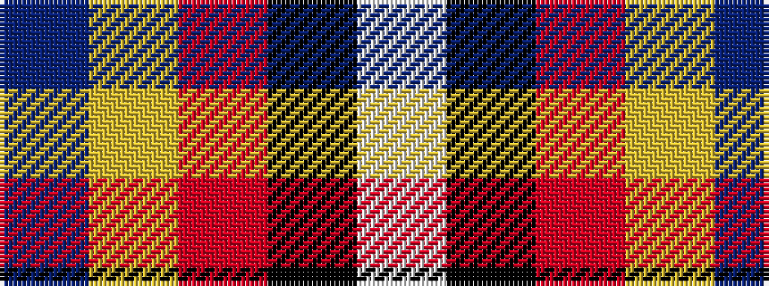

BYRKW

It is a 5 stripe tartan.

<figure class="pat-woven">

<figcaption>idealised sample</figcaption>
</figure>

## Colour Sequence



## Tartans with this colour sequence

| Tartans |
|---------------|
| [Wormeck (2013) Germany](/setts/s5/db4lo4r33k30w2~x2/)|
||
