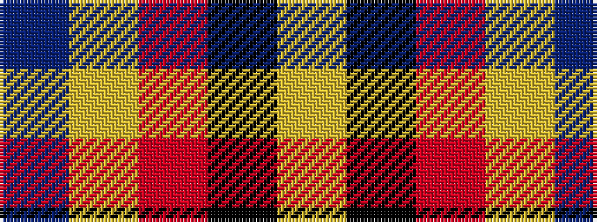

BYRKY

It is a 5 stripe tartan.

<figure class="pat-woven">

<figcaption>idealised sample</figcaption>
</figure>

## Colour Sequence



## Tartans with this colour sequence

| Tartans |
|---------------|
| [Scottish American Athletic Assoc](/setts/s5/ly32k21r16lr6dt4~x2/)|
||
