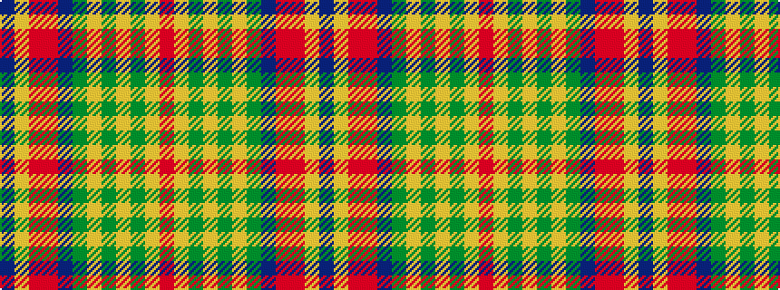

BYRRBGYGYGYR

It is a 12 stripe tartan.

<figure class="pat-woven">

<figcaption>idealised sample</figcaption>
</figure>

## Colour Sequence



## Tartans with this colour sequence

| Tartans |
|---------------|
| [Bridge of Weir Leather Co. (Corp)](/setts/s12/r3ly14y3ly3y3ly4y11dt11ri11r11ly1dt1~x2/)|
||
