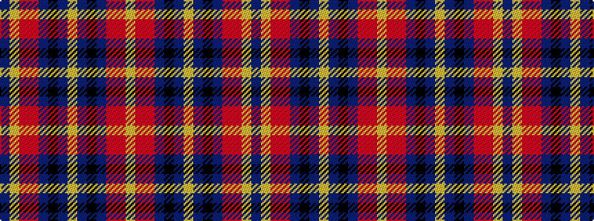

BYRRBKBYBKBRRY

It is a 14 stripe tartan.

<figure class="pat-woven">

<figcaption>idealised sample</figcaption>
</figure>

## Colour Sequence



## Tartans with this colour sequence

| Tartans |
|---------------|
| [Hyland Evening (Personal)](/setts/s14/dp3lo2r19ri4dpi6k36dpi2lo3~x2/)|
||
