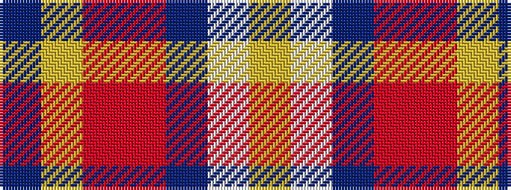

BYRRBWY

It is a 7 stripe tartan.

<figure class="pat-woven">

<figcaption>idealised sample</figcaption>
</figure>

## Colour Sequence



## Tartans with this colour sequence

| Tartans |
|---------------|
| [Galvez-Brown](/setts/s7/db36ly5r12r9dp5w12ly7~x2/)|
||
| [Galvez-Brown (Personal)](/setts/s7/dt36lo5r12r9dp5w12lo7~x2/)|
||
