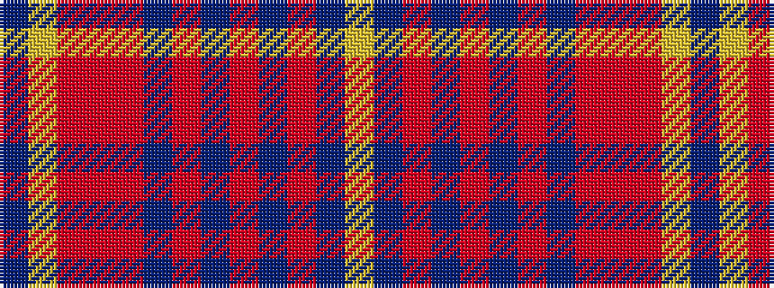

BYRRRBRBRBRBY

It is a 13 stripe tartan.

<figure class="pat-woven">

<figcaption>idealised sample</figcaption>
</figure>

## Colour Sequence



## Tartans with this colour sequence

| Tartans |
|---------------|
| [Sandbaggers (Corporate)](/setts/s13/lr6n3o7n2o5n8o5n15o18r2o2ly2b3~x2/)|
||
