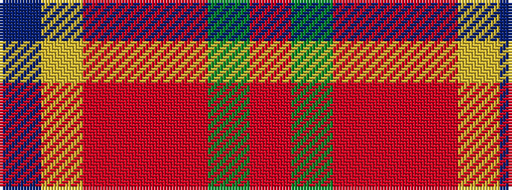

BYRRRGR

It is a 7 stripe tartan.

<figure class="pat-woven">

<figcaption>idealised sample</figcaption>
</figure>

## Colour Sequence



## Tartans with this colour sequence

| Tartans |
|---------------|
| [Spragg (Name)](/setts/s7/ri2g16r1ri2r12ly1t1~x2/)|
||
