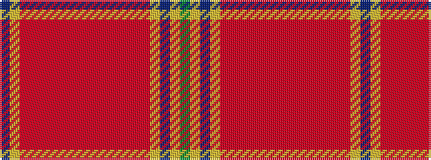

BYRRRRRRRRRRRRRYBYG

It is a 19 stripe tartan.

<figure class="pat-woven">

<figcaption>idealised sample</figcaption>
</figure>

## Colour Sequence



## Tartans with this colour sequence

| Tartans |
|---------------|
| [Commonwealth Games Scotland, Team Scotland 2014](/variants/s19/g33lo22db4lo22r3m2r3m2r3m2r3m2r3m2r3m2r3lo22db4~x2/)|
||
