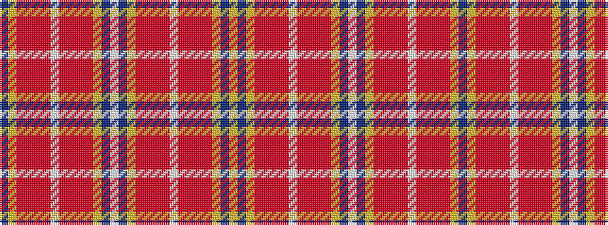

BYRRRRWRRRRYBWBYRRRRWRRRRYBY

It is a 28 stripe tartan.

<figure class="pat-woven">

<figcaption>idealised sample</figcaption>
</figure>

## Colour Sequence



## Tartans with this colour sequence

| Tartans |
|---------------|
| [Wisconsin in Scotland](/setts/s28/db11ly1r2o1r2r2w1r2r2o1r2ly1db11w1db11ly1r2o1r2r2w1r2r2o1r2ly1db11ly1~x8/)|
||
