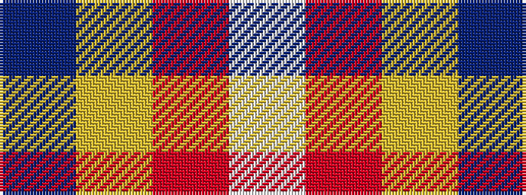

BYRW

It is a 4 stripe tartan.

<figure class="pat-woven">

<figcaption>idealised sample</figcaption>
</figure>

## Colour Sequence



## Tartans with this colour sequence

| Tartans |
|---------------|
| [Norwich University](/variants/s4/db39lo8r3w1~x4/)|
||
| [Norwich University (Corporate)](/variants/s4/db39ly8r3w1~x4/)|
||
