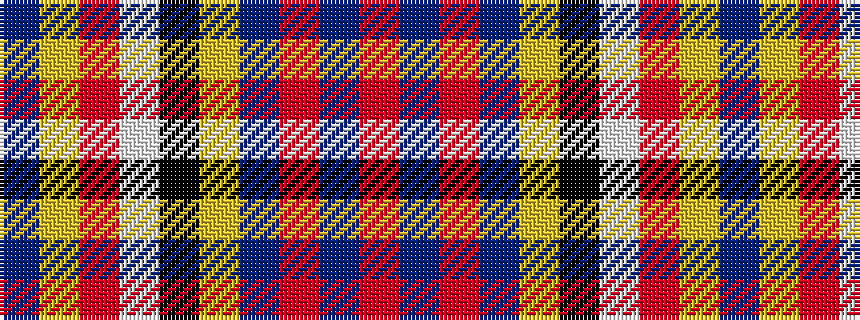

BYRWKYBRBR

It is a 10 stripe tartan.

<figure class="pat-woven">

<figcaption>idealised sample</figcaption>
</figure>

## Colour Sequence



## Tartans with this colour sequence

| Tartans |
|---------------|
| [Commonwealth](/setts/s10/dt6lo2r6lb3k2lo6dt10r2dt3r2~x4/)|
||
