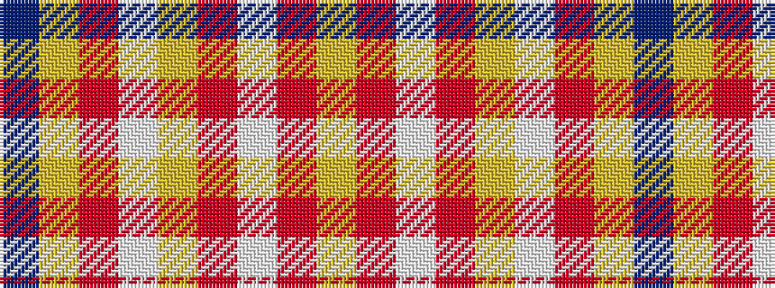

BYRWYRWRY

It is a 9 stripe tartan.

<figure class="pat-woven">

<figcaption>idealised sample</figcaption>
</figure>

## Colour Sequence



## Tartans with this colour sequence

| Tartans |
|---------------|
| [Hybelius, J-A (Personal)](/setts/s9/dt58ly2r1lb4ly2r2lb7r8ly6~x2/)|
||
