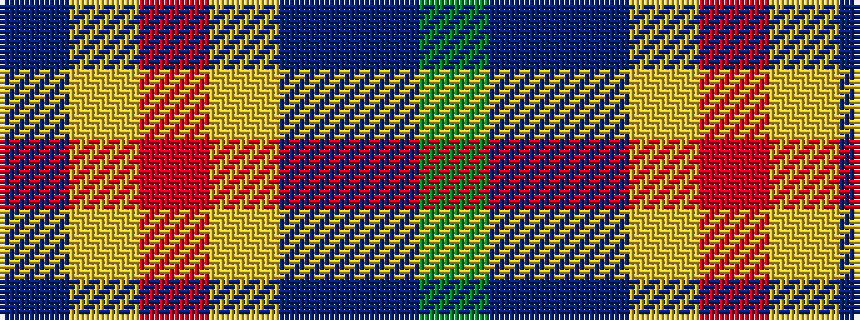

BYRYBBG

It is a 7 stripe tartan.

<figure class="pat-woven">

<figcaption>idealised sample</figcaption>
</figure>

## Colour Sequence



## Tartans with this colour sequence

| Tartans |
|---------------|
| [F.I.A.T.A. Congress of 1990](/setts/s7/dg12b8db4ly2r1ly1db6~x4/)|
||
