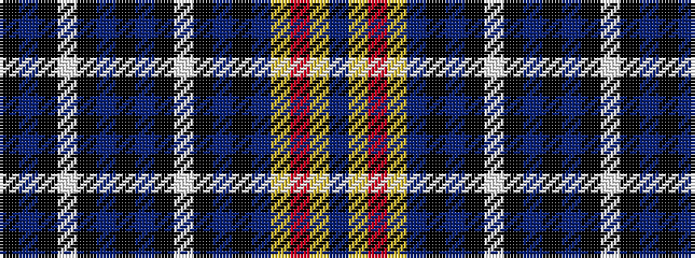

BYRYBKBKWKBKBKWKBK

It is a 18 stripe tartan.

<figure class="pat-woven">

<figcaption>idealised sample</figcaption>
</figure>

## Colour Sequence



## Tartans with this colour sequence

| Tartans |
|---------------|
| [Estonian National Tartan Estonian District Tartan](/variants/s18/b32ly1r3ly1b32k5b3k2w1k2b3k53b3k2w1k2b3k5~x2/)|
||
