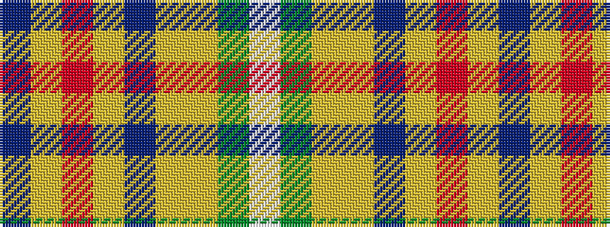

BYRYBYYGW

It is a 9 stripe tartan.

<figure class="pat-woven">

<figcaption>idealised sample</figcaption>
</figure>

## Colour Sequence



## Tartans with this colour sequence

| Tartans |
|---------------|
| [Elystan Glodrydd (Name)](/setts/s9/w2dg27ly1lo7t5ly5r17ly6t1~x2/)|
||
| [Elystan Glodrydd (Welsh Tribe)](/setts/s9/w2g27ly1lo7b5ly5r17ly6b1~x2/)|
||
