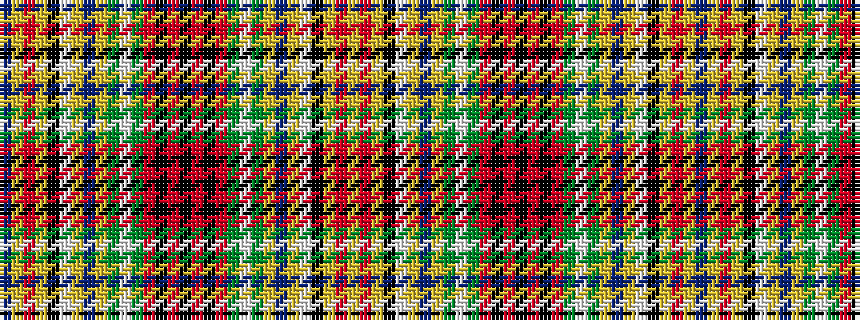

BYRYKWYBYGWGRKRKRKRGWGYBYWKYRY

It is a 30 stripe tartan.

<figure class="pat-woven">

<figcaption>idealised sample</figcaption>
</figure>

## Colour Sequence



## Tartans with this colour sequence

| Tartans |
|---------------|
| [Huntly #2](/setts/s30/b16lr2r7lr2k14lb6lr2b15lr2dg17lb6dg6ri8k6ri8k2~x2/)|
||
