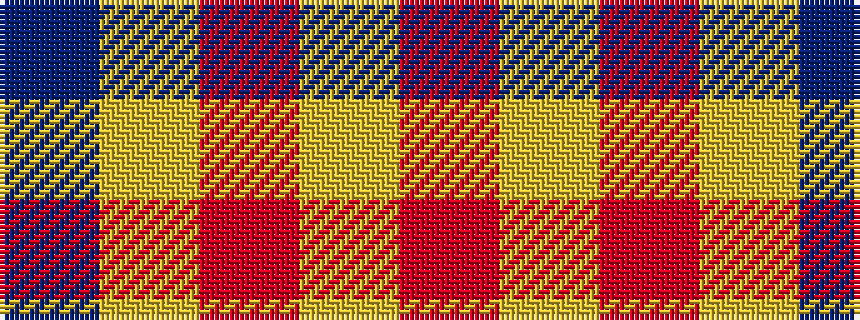

BYRYR

It is a 5 stripe tartan.

<figure class="pat-woven">

<figcaption>idealised sample</figcaption>
</figure>

## Colour Sequence



## Tartans with this colour sequence

| Tartans |
|---------------|
| [Carlisle Ancient](/setts/s5/b11lo2r1lo2r1~x4/)|
||
| [Carlisle, Ancient](/setts/s5/t11ly2r1ly2r1~x4/)|
||
